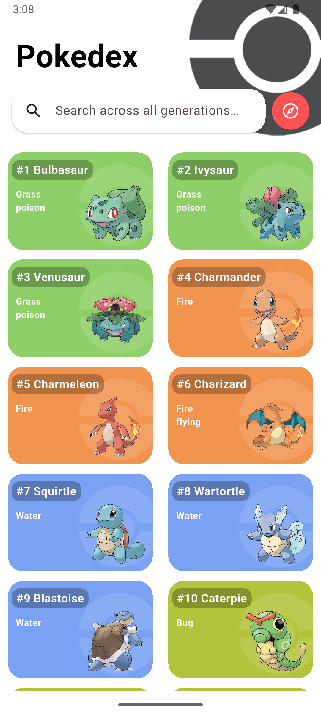
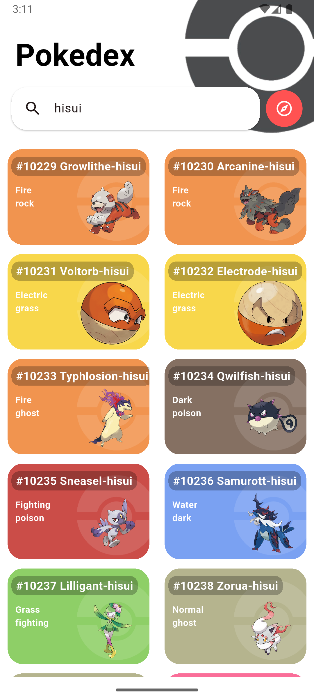
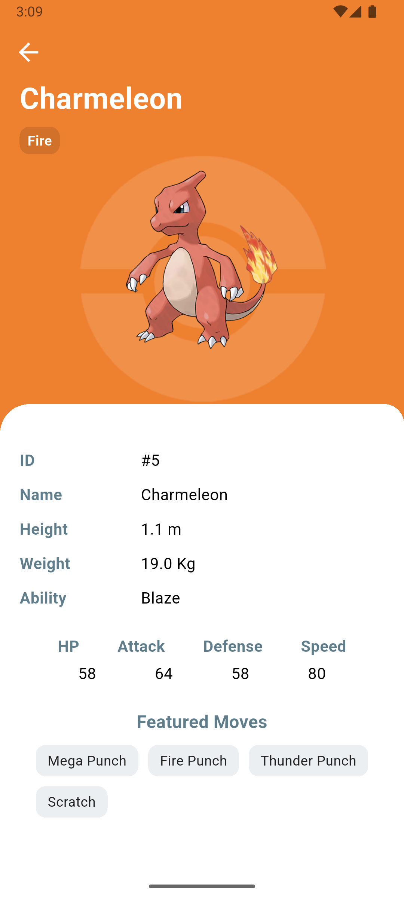

# PokeDex Flutter Application


## Developed as part of the **Skill Development Program** in college

A **PokeDex** application built using **Flutter** that allows users to explore detailed information about various Pokémon. The app uses the **PokéAPI**, a RESTful API, to retrieve and display data in an interactive and engaging way.

---

## Features

- **Pokémon Information**: Retrieves detailed data on a wide variety of Pokémon, including their names, types, abilities, stats, and more.
- **Search Functionality**: Allows users to search for Pokémon by name and get their respective information.
- **Responsive UI**: Built with Flutter, ensuring smooth and responsive performance across different screen sizes.
- **Interactive Design**: Provides an engaging user experience with easy navigation and colorful designs.

---

## Installation Instructions

### 1. Clone the Repository

```bash
git clone https://github.com/Sourish-Kanna/Flutter-SDP-PokeDex.git
```

### 2. Install Dependencies

Navigate to the project directory and install the necessary dependencies:

```bash
cd Flutter-SDP-PokeDex
flutter pub get
```

### 3. Run the Application

Make sure you have an Android or iOS emulator running, or connect a device, then run the app:

```bash
flutter run
```

---

## How to Use

1. **Explore Pokémon**: Once the app is running, use the search bar to look for specific Pokémon by name.
2. **View Details**: Click on a Pokémon to view detailed information such as its type, stats, and abilities.
3. **Navigation**: Navigate easily between the list of Pokémon and detailed views using simple swipe gestures and taps.

---

## Dependencies

- **Flutter**: Framework for building the app.
- **PokéAPI**: RESTful API used to fetch Pokémon data.
- **Provider**: State management solution for Flutter.
- **http**: Package to make HTTP requests to the PokéAPI.

---

## Screenshots

| Home | Search | Detail |
| :---: | :---: | :---: |
|  |  | |

---

## Recent Updates & Optimizations

I recently tweaked the app to handle all generations and run completely on raw HTTP. Here is what's new:

- **All-Generation Lazy Loading:** Expanded the query to fetch all 1025+ Pokémon across all generations in one go. The `GridView.builder` handles this efficiently by only fetching details for cards visible on screen as you scroll.
- **Instant Local Cache:** Added `shared_preferences` to cache the global catalog on the device. The app now loads instantly on subsequent boots, even if you are entirely offline.
- **No More Duplicate Network Requests:** The app now extracts the official artwork image URL directly from the initial single detail payload, cutting out the second image API call entirely.
- **Material 3 Autocomplete Search:** Upgraded the search bar to a modern `SearchAnchor.bar`. It gives real-time type-ahead suggestions as you type and filters everything flawlessly when you hit Enter.
- **Bidirectional Scroll FAB:** Added a smart Floating Action Button that changes based on where you are—it points down to jump to the bottom when you're near the top, and turns into an up-arrow to zip back to the top once you cross the midpoint.
- **Legibility & Color Tweaks:** The cards still match the Pokémon's type color, but the detail screen now checks the background brightness dynamically to automatically switch text between black and white so it's always readable.
- **Strict Light Mode:** Cleaned up the styles and locked the app to a solid light mode theme using `ThemeMode.light`.

---

## License

This project is licensed under the MIT License - see the [LICENSE](LICENSE) file for details.
